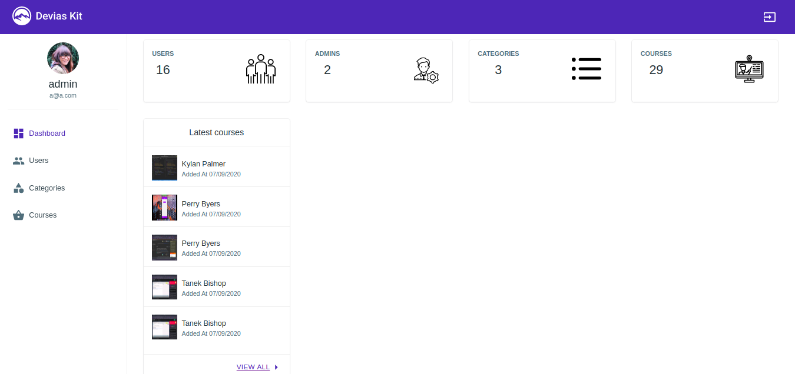
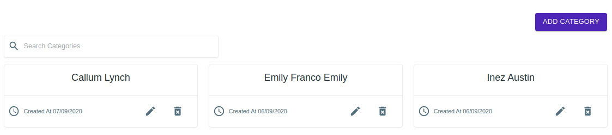
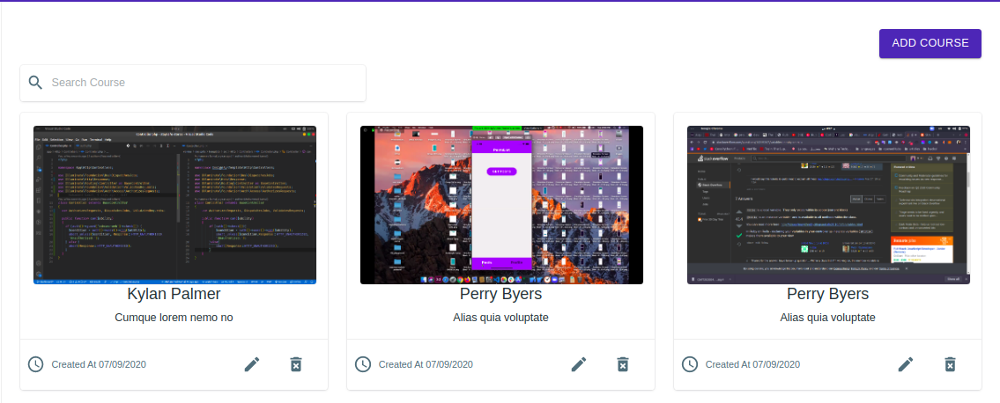
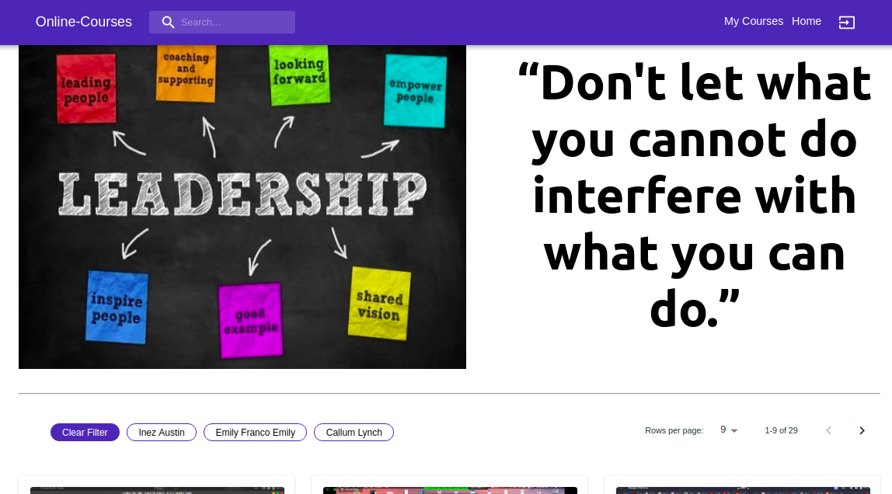
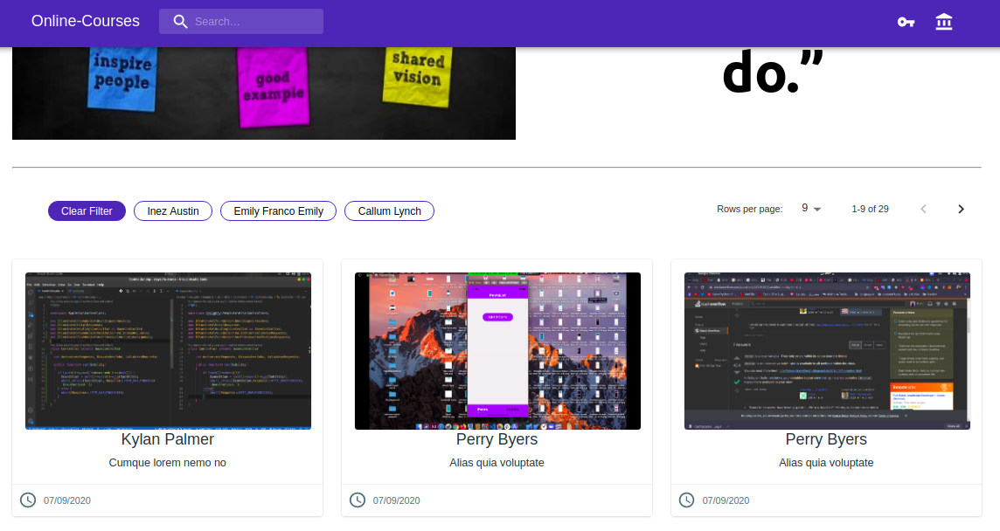
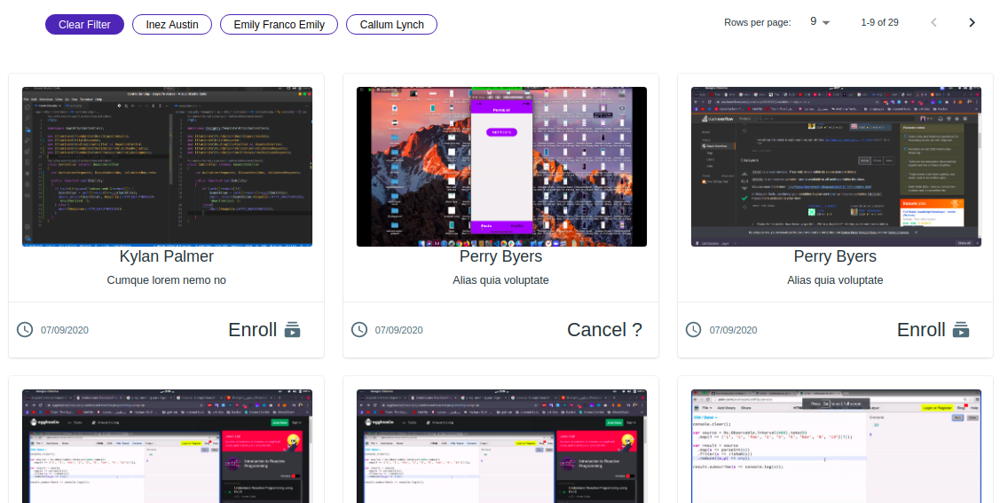
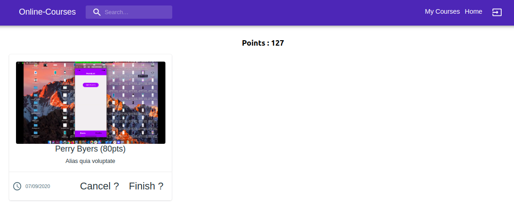

# Online Courses
proof of concept for an online courses platform

## Installation

copy then paste the following lines into terminal
- $ git clone https://github.com/Mahmoud-Mohamed-Elgamily/simple-online-courses-app.git
- $ cd server
- $ npm i
- $ npm i
- $ npm run dev
- configure .env file with database credentials then run the following command
- $ php artisan migrate
- $ php artisan serve

## Workflow
- Backend(Express)
  - setting up DataBase
  - creating migrations
  - creating models
  - adding middleware for jwt authentication
  - creating api routes and controllers
  
- Frontend(React)
  - integrating material ui admin dashboard
  - remove unused components, menu items and dependencies 
  - create userProvider to access user data easily
  - create serverHandler for handling request to server
  - create authService to help authenticate user (login / register)
  - create component for crud Users
  - create component for crud Categories
  - create component for crud Courses
  
  - create component for client to be able to view courses
  - user can filter courses based on categories 
  - user can search through courses using course name
  - user can enroll to courses
  - user can cancel enrollment
  - user can finish courses and get points 

# Pictures

-Admin Home

-Admin Users

-Admin Categories

-Admin Courses 

-Client Home

-Client Courses

-Logged Client Home

-Logged Client Courses

